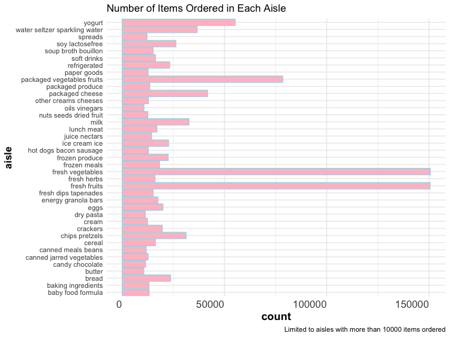
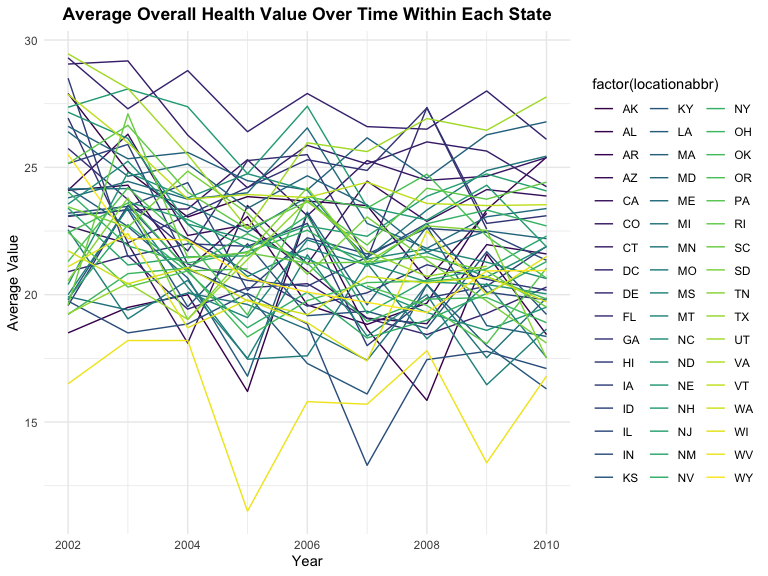
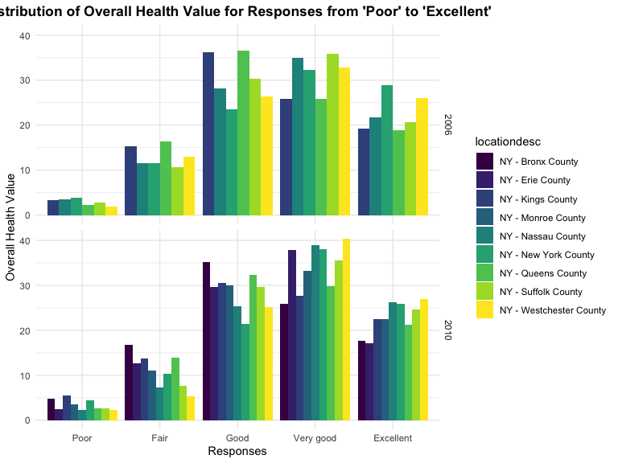
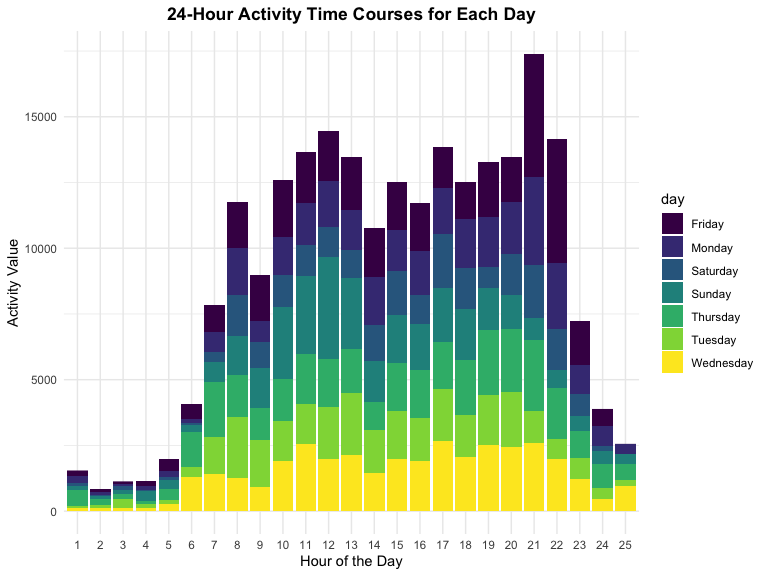

p8105\_hw3\_ml4420
================
Mengjia Lyu
2019-10-13

# Problem 1

``` r
# load the data
data("instacart")

# check the number of rows and columns
dim(instacart)
```

    ## [1] 1384617      15

``` r
# view the structure of data
str(instacart)
```

    ## Classes 'tbl_df', 'tbl' and 'data.frame':    1384617 obs. of  15 variables:
    ##  $ order_id              : int  1 1 1 1 1 1 1 1 36 36 ...
    ##  $ product_id            : int  49302 11109 10246 49683 43633 13176 47209 22035 39612 19660 ...
    ##  $ add_to_cart_order     : int  1 2 3 4 5 6 7 8 1 2 ...
    ##  $ reordered             : int  1 1 0 0 1 0 0 1 0 1 ...
    ##  $ user_id               : int  112108 112108 112108 112108 112108 112108 112108 112108 79431 79431 ...
    ##  $ eval_set              : chr  "train" "train" "train" "train" ...
    ##  $ order_number          : int  4 4 4 4 4 4 4 4 23 23 ...
    ##  $ order_dow             : int  4 4 4 4 4 4 4 4 6 6 ...
    ##  $ order_hour_of_day     : int  10 10 10 10 10 10 10 10 18 18 ...
    ##  $ days_since_prior_order: int  9 9 9 9 9 9 9 9 30 30 ...
    ##  $ product_name          : chr  "Bulgarian Yogurt" "Organic 4% Milk Fat Whole Milk Cottage Cheese" "Organic Celery Hearts" "Cucumber Kirby" ...
    ##  $ aisle_id              : int  120 108 83 83 95 24 24 21 2 115 ...
    ##  $ department_id         : int  16 16 4 4 15 4 4 16 16 7 ...
    ##  $ aisle                 : chr  "yogurt" "other creams cheeses" "fresh vegetables" "fresh vegetables" ...
    ##  $ department            : chr  "dairy eggs" "dairy eggs" "produce" "produce" ...
    ##  - attr(*, "spec")=
    ##   .. cols(
    ##   ..   order_id = col_integer(),
    ##   ..   product_id = col_integer(),
    ##   ..   add_to_cart_order = col_integer(),
    ##   ..   reordered = col_integer(),
    ##   ..   user_id = col_integer(),
    ##   ..   eval_set = col_character(),
    ##   ..   order_number = col_integer(),
    ##   ..   order_dow = col_integer(),
    ##   ..   order_hour_of_day = col_integer(),
    ##   ..   days_since_prior_order = col_integer(),
    ##   ..   product_name = col_character(),
    ##   ..   aisle_id = col_integer(),
    ##   ..   department_id = col_integer(),
    ##   ..   aisle = col_character(),
    ##   ..   department = col_character()
    ##   .. )

``` r
# describe key variables
names(instacart)
```

    ##  [1] "order_id"               "product_id"            
    ##  [3] "add_to_cart_order"      "reordered"             
    ##  [5] "user_id"                "eval_set"              
    ##  [7] "order_number"           "order_dow"             
    ##  [9] "order_hour_of_day"      "days_since_prior_order"
    ## [11] "product_name"           "aisle_id"              
    ## [13] "department_id"          "aisle"                 
    ## [15] "department"

``` r
# illustrative examples of observations
hist(instacart$order_hour_of_day)
```


The dataset contains 1384617 rows and 15 columns. Key variables include

  - order\_id: order identifier
  - product\_id: product identifier
  - user\_id: customer identifier
  - order\_dow: the day of the week on which the order was placed
  - order\_hour\_of\_day: the hour of the day on which the order was
    placed
  - product\_name: name of the product
  - aisle\_id: aisle identifier
  - department\_id: department identifier

From the illustration of the *order\_hour\_of\_day* variable, we can see
that 13-14PM is the most popular time.

``` r
instacart %>%
  summarise(n_distinct(aisle))  # return the number of aisles
```

    ## # A tibble: 1 x 1
    ##   `n_distinct(aisle)`
    ##                 <int>
    ## 1                 134

``` r
tail(names(sort(table(instacart$aisle))), 1) # return the aisle which most items ordered from
```

    ## [1] "fresh vegetables"

``` r
# plot showing the number of items ordered in each aisle for aisles with more than 10000 items
aisle_plot = instacart %>% 
  group_by(aisle) %>%
  mutate(n_aisle = n()) %>%
  filter(n_aisle > 10000) %>%
  ggplot(aes(x = aisle)) + geom_bar(color = "lightblue", fill = "pink") + theme(axis.text.x = element_text(angle = 90, hjust = 1, size = 13),       
  axis.title.y = element_text(size = 13), axis.title = element_text(size = 14, face = "bold")) +
  coord_flip() +
  theme(axis.text.x = element_text(angle = 360)) +
  labs(title = "Number of Items Ordered in Each Aisle", caption = "Limited to aisles with more than 10000 items ordered")
aisle_plot  
```



``` r
# create a table for three most popular items in baking/dog food/packaged vegetable fruit
tab_most_ppl = instacart  %>%
  filter(aisle == "dog food care" | aisle == "packaged vegetables fruits" | aisle == "baking ingredients") %>%
  group_by(aisle) %>%
  count(product_name) %>%
  arrange(desc(n))%>%
  top_n(3) 
```

    ## Selecting by n

``` r
knitr::kable(tab_most_ppl)
```

| aisle                      | product\_name                                 |    n |
| :------------------------- | :-------------------------------------------- | ---: |
| packaged vegetables fruits | Organic Baby Spinach                          | 9784 |
| packaged vegetables fruits | Organic Raspberries                           | 5546 |
| packaged vegetables fruits | Organic Blueberries                           | 4966 |
| baking ingredients         | Light Brown Sugar                             |  499 |
| baking ingredients         | Pure Baking Soda                              |  387 |
| baking ingredients         | Cane Sugar                                    |  336 |
| dog food care              | Snack Sticks Chicken & Rice Recipe Dog Treats |   30 |
| dog food care              | Organix Chicken & Brown Rice Recipe           |   28 |
| dog food care              | Small Dog Biscuits                            |   26 |

``` r
# create a table for the mean hour of the day at which Pink Lady Apples and Coffee Ice Cream ordered on each day of the week
tab_mean_hour = instacart %>%
  filter(product_name %in% c("Pink Lady Apples", "Coffee Ice Cream")) %>%
  select(product_name, order_dow, order_hour_of_day) %>% # select the correct columns
  mutate(order_dow = plyr::mapvalues(order_dow, from = c(0, 1, 2, 3, 4, 5, 6), to = c("Sunday", "Monday", "Tuesday", 
  "Wednesday", "Thursday", "Friday", "Saturday"))) %>%
  group_by(order_dow, product_name) %>%
  mutate(mean_hour = mean(order_hour_of_day)) %>%
  select(-order_hour_of_day) %>%
  distinct() %>%
  pivot_wider( # pivot wider 
    names_from = order_dow,
    values_from = mean_hour
  ) 

knitr::kable(tab_mean_hour)
```

| product\_name    | Wednesday |  Tuesday |   Monday | Saturday | Thursday |   Sunday |   Friday |
| :--------------- | --------: | -------: | -------: | -------: | -------: | -------: | -------: |
| Pink Lady Apples |  14.25000 | 11.70213 | 11.36000 | 11.93750 | 11.55172 | 13.44118 | 12.78431 |
| Coffee Ice Cream |  15.31818 | 15.38095 | 14.31579 | 13.83333 | 15.21739 | 13.77419 | 12.26316 |

# Problem 2

``` r
# load data from Behavioral Risk Factors Surveillance Systems
data("BRFSS")

# tidy data
BRFSS_tidy_data = brfss_smart2010 %>%
 janitor::clean_names() %>% # format the data to use appropriate variable names
 filter(topic == "Overall Health") %>% # focus on the "Overall Health" topic
 filter(response %in% c("Excellent", "Very good", "Good", "Fair", "Poor")) %>% # include only responses from "Excellent" to "Poor"
 mutate(response = factor(response, ordered = TRUE, levels = c("Poor", "Fair", "Good", "Very good", "Excellent"))) # ordered levels

# search for states observed at 7 or more locations in 2002
states_2002 = BRFSS_tidy_data %>%
 filter(year == 2002) %>%
 select(locationabbr, locationdesc) %>%
 arrange(locationabbr, locationdesc) %>%
 distinct() %>%
 group_by(locationabbr) %>%
 count() %>%
 filter(n > 7 | n == 7)

 # list out the states  
list(pull(states_2002, locationabbr))
```

    ## [[1]]
    ## [1] "CT" "FL" "MA" "NC" "NJ" "PA"

We can see that CT, FL, MA, NC, NJ, PA were observed at 7 or more
locations in 2002.

``` r
# search for states observed at 7 or more locations in 2010
states_2010 = BRFSS_tidy_data %>%
 filter(year == 2010) %>%
 select(locationabbr, locationdesc) %>%
 arrange(locationabbr, locationdesc) %>%
 distinct() %>%
 group_by(locationabbr) %>%
 count() %>%
 filter(n > 7 | n == 7)

# list out states
list(pull(states_2010, locationabbr)) 
```

    ## [[1]]
    ##  [1] "CA" "CO" "FL" "MA" "MD" "NC" "NE" "NJ" "NY" "OH" "PA" "SC" "TX" "WA"

We can see that CA, CO, FL, MA, MD, NC, NE, NJ, NY, OH, PA, SC, TX, WA
were observed at 7 or more locations in 2010.

``` r
# create a sphagetti plot
sphagetti_plot = BRFSS_tidy_data %>%
 filter(response == "Excellent") %>% # limited to "Excellent" responses
 select(year, locationabbr, locationdesc, data_value) %>%
 arrange(locationabbr, locationdesc) %>%
 group_by(locationabbr, year) %>%
 summarise(avg_data_value = mean(data_value)) %>%
 ggplot(aes(x = year, y = avg_data_value, color = factor(locationabbr))) + geom_line(aes(group = locationabbr)) +
 ggtitle(label = "Average Overall Health Value Over Time Within Each State") +
 theme_minimal() + theme(plot.title = element_text(hjust = 0.5, lineheight = .8, face = "bold")) +
 xlab("Year") + ylab("Average Value")

sphagetti_plot
```



``` r
# create a two panel bar plot
two_panel_plot = BRFSS_tidy_data %>%
 filter(locationabbr == "NY" & year %in% c(2006, 2010)) %>%
 select(data_value, response, year, locationdesc) %>%
 ggplot(aes(x = response, y = data_value, fill = locationdesc)) + # use fill to differentiate counties
 geom_bar(stat = "identity", position = "dodge") + facet_grid(year ~ .) + # use dodge to place two graphs side by side
 ggtitle(label = "Distribution of Overall Health Value for Responses from 'Poor' to 'Excellent'") +
 theme_minimal() + theme(plot.title = element_text(hjust = 0.5, lineheight = .8, face = "bold")) +
 xlab("Responses") + ylab("Overall Health Value")

two_panel_plot 
```



# Problem 3

``` r
# load and clean data
accel_data = read_csv(file = "./data/accel_data.csv") %>%
 janitor::clean_names() %>%
 mutate(day_type = plyr::mapvalues(day, from = c("Monday", "Tuesday", "Wednesday", "Thursday", "Friday", "Saturday", "Sunday"),
 to = c("Weekday", "Weekday", "Weekday", "Weekday", "Weekday", "Weekend", "Weekend"))) %>%
 mutate(day = factor(day)) # encode day into factor variable since a week always has 7 unique day values
```

    ## Parsed with column specification:
    ## cols(
    ##   .default = col_double(),
    ##   day = col_character()
    ## )

    ## See spec(...) for full column specifications.

The variables that exist are week, day\_id, day, and activity\_\*
(\*denote the number of minutes in the day). The dataset has 35 rows and
1444 columns and 50540 many observations.

``` r
# create table showing totals
accel_data_df = accel_data %>%
 mutate(total_activity = accel_data %>% select(starts_with("activity_")) %>% rowSums()) %>%
 select(week, day, total_activity) %>%
 pivot_wider(
 names_from = "day",
 values_from = "total_activity")
# reorganize columns
accel_data_df = accel_data_df[, c(1, 5, 3, 7, 8, 6, 2, 4)]

knitr::kable(accel_data_df)
```

| week | Sunday |    Monday |  Tuesday | Wednesday | Thursday |   Friday | Saturday |
| ---: | -----: | --------: | -------: | --------: | -------: | -------: | -------: |
|    1 | 631105 |  78828.07 | 307094.2 |    340115 | 355923.6 | 480542.6 |   376254 |
|    2 | 422018 | 295431.00 | 423245.0 |    440962 | 474048.0 | 568839.0 |   607175 |
|    3 | 467052 | 685910.00 | 381507.0 |    468869 | 371230.0 | 467420.0 |   382928 |
|    4 | 260617 | 409450.00 | 319568.0 |    434460 | 340291.0 | 154049.0 |     1440 |
|    5 | 138421 | 389080.00 | 367824.0 |    445366 | 549658.0 | 620860.0 |     1440 |

It can be seen that for the subject physical activity has decreased
every week on Sundays but increased or roughly stay the same on
weekdays. The subject don’t much much physical activity on Saturday for
the last two weeks.

``` r
# single panel plot

accel_data_plot = accel_data %>%
 pivot_longer(
 activity_1:activity_1440,
 names_to = "minute",
 values_to = "activity"
 ) %>%
 mutate(minute = as.integer(substring(minute, 10))) %>%
 mutate(hour_id = factor(floor(minute/60) + 1)) %>%   # aggregate minutely data into hourly data for better readability
 group_by(week, day, hour_id) %>%
 summarise(hour_activity = mean(activity)) %>%
 ggplot(aes(x = hour_id, y = hour_activity, fill = day)) + geom_bar(stat = "identity", na.rm = TRUE) +
 ggtitle(label = "24-Hour Activity Time Courses for Each Day") +
 theme_minimal() + theme(plot.title = element_text(hjust = 0.5, lineheight = .8, face = "bold")) +
 xlab("Hour of the Day") + ylab("Activity Value")

accel_data_plot
```



We can see that on Friday the overall physical activity is the highest
and on Wednesday the overall physical activity is the lowest. The man
seems to sleep from 12PM to 5AM and is most active from 11-13 and 17-21
every day.
